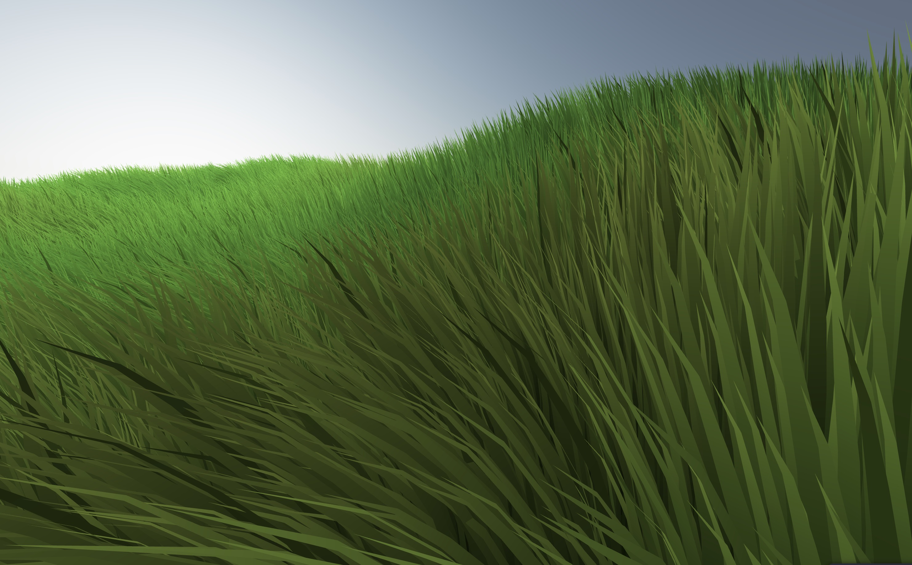

# Zephyr

[](./LICENSE)

> [!NOTE]
> The name of this project comes from Zephyrus, the god of the west wind.

Zephyr is a real-time graphics showcase built with **React Three Fiber**,
**Three.js** and **GLSL**, centered on a unified wind simulation that animates a
vast field of grass. It leverages GPU instancing and custom shaders to render
hundreds of thousands of blades at 60 fps in the browser.



## Features

Zephyr renders a field of 160 000 instanced blades (400 x 400) in a single draw
call, with all animation and lighting handled on the GPU through custom GLSL
shaders (`grass.vert` / `grass.frag`). A unified wind system drives
everything from one source of truth: gusts, calm cycles, slow directional
drift, traveling gust waves and tip turbulence, while blades group into Voronoï
tufts with a per-clump orientation and a subtle dome bend (about 5% are taller
"accent" blades).

The grass shading layers half-Lambert diffuse, subsurface translucency
(Barré-Brisebois transmission), a soft tip specular with a silvery Fresnel sheen
and height-based ambient occlusion, and three biome palettes (colour patches) are blended via
simplex noise with a randomisable seed. Placement is deterministic: a seeded
mulberry32 PRNG keeps the layout stable across reloads, and a sun system ties
the `<Sky>`, the directional light and the shader's sun direction together, with
every wind, sun and colour parameter exposed live through
[leva](https://github.com/pmndrs/leva) controls.

## For local run

**Prerequisites:** Node.js 20+ and npm.

```bash
# install dependencies
npm install

# start the dev server
npm run dev
```

## Credits

- Grass subsurface scattering based on the transmission model by Colin
  Barré-Brisebois & Marc Bouchard ([Approximating Translucency for a Fast,
  Cheap and Convincing Subsurface Scattering Look](https://www.gdcvault.com/play/1014538/Approximating-Translucency-for-a-Fast), GDC 2011).
- 2D simplex noise via [simplex-noise](https://github.com/jwagner/simplex-noise.js)
  (JS) and an inlined GLSL port for the shaders.
- Colour patches inspired by [How I made grass better than 99% of games | Stylized grass 3D pixel art](https://youtu.be/OxsuWDtjuGw?t=125).
- Wind simulation inspired by [Blowing from the West: Simulating Wind in Ghost of Tsushima (GDC)](https://gdcvault.com/play/1027124/Blowing-from-the-West-Simulating).

## License

This project is licensed under the MIT License, see the [LICENSE](./LICENSE)
file for details.
